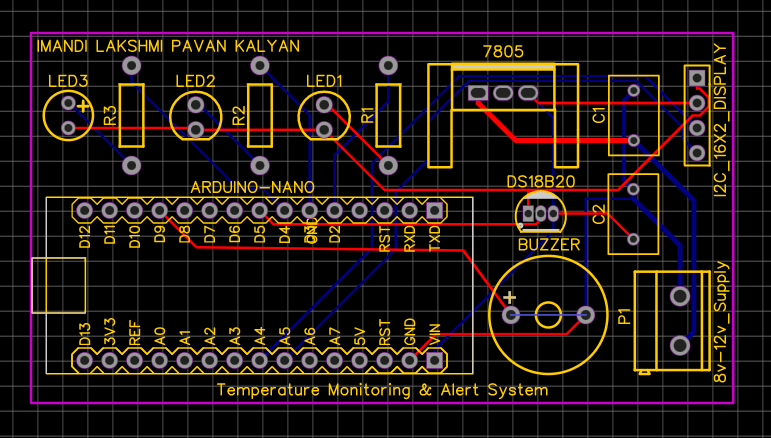
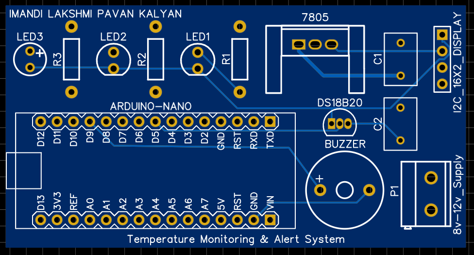
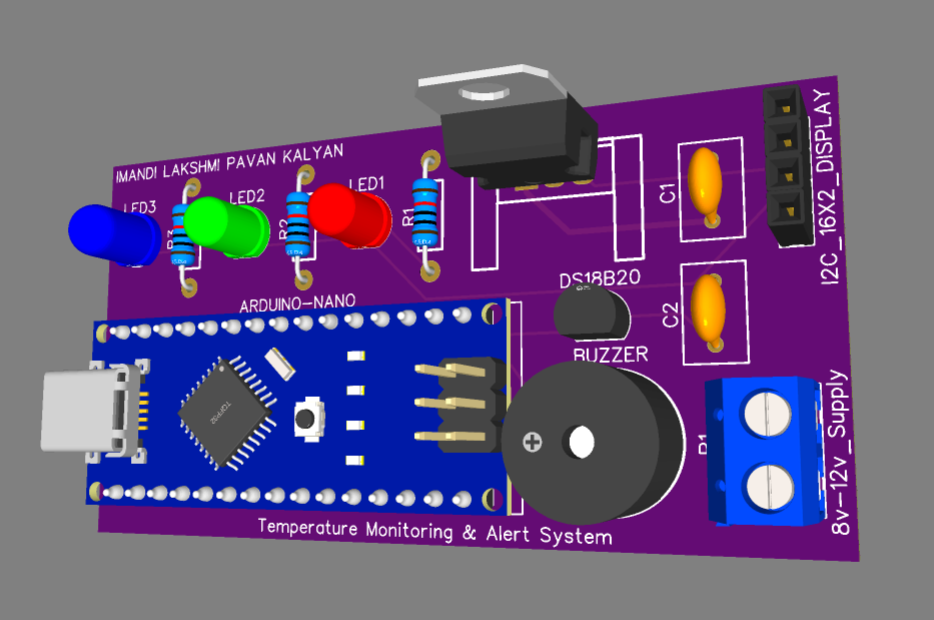
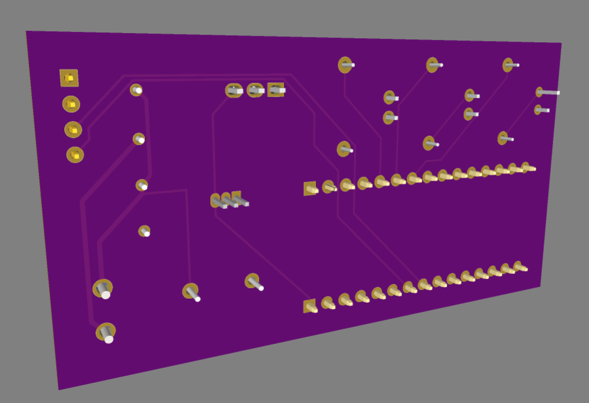
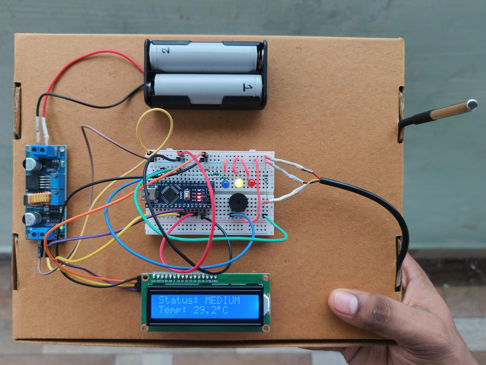
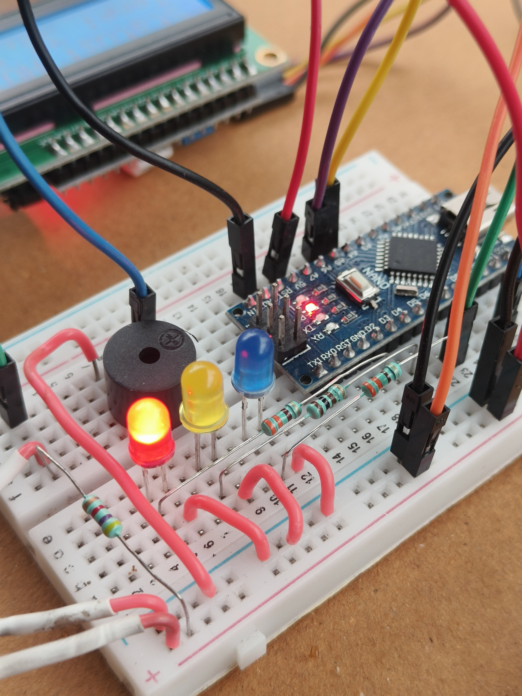
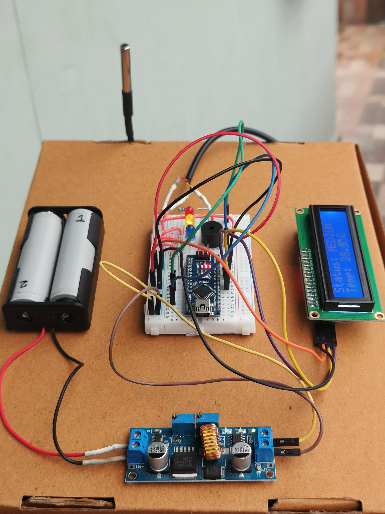

# 🌡️ Temperature Monitoring & Alert System

An embedded temperature monitoring and alert system designed to continuously measure temperature using a **DS18B20 digital temperature sensor** and indicate the temperature condition using **Red, Yellow, and Blue LEDs** along with an audible buzzer alert.

The system is built around an **Arduino Nano** and includes a custom-designed **PCB, 3D PCB visualization, circuit schematic, voltage regulation stage, and hardware prototype**.

---

## 📌 Project Overview

The **Temperature Monitoring & Alert System** monitors the surrounding temperature in real time and categorizes the measured temperature into three conditions:

| Temperature     | Condition  | LED Indication         |
| --------------- | ---------- | ---------------------- |
| **Below 25°C**  | 🧊 Cool    | 🔵 Blue LED            |
| **25°C – 35°C** | 🌡️ Medium | 🟡 Yellow LED          |
| **Above 35°C**  | 🔥 Hot     | 🔴 Red LED + 🔊 Buzzer |

This project demonstrates the practical implementation of:

* Embedded systems
* Digital temperature sensing
* Arduino-based control
* LED status indication
* Audible alert generation
* DC voltage regulation
* PCB design
* PCB layout and routing
* 3D PCB visualization
* Hardware prototyping

---

## 🎯 Objectives

* Measure temperature accurately using the **DS18B20 sensor**.
* Process the temperature data using an **Arduino Nano**.
* Provide clear visual indication through three LEDs.
* Generate an audible warning during high-temperature conditions.
* Convert the input DC supply to a regulated **5V supply** for the electronics.
* Design and manufacture a custom PCB.
* Develop a compact and reliable embedded hardware prototype.

---

## ⚙️ System Working

The system operates according to the following sequence:

```text
        Temperature
             │
             ▼
      ┌─────────────┐
      │   DS18B20   │
      │ Temperature │
      │   Sensor    │
      └──────┬──────┘
             │
             ▼
      ┌─────────────┐
      │   Arduino   │
      │    Nano     │
      └──────┬──────┘
             │
       ┌─────┼─────┐
       │     │     │
       ▼     ▼     ▼
     BLUE  YELLOW  RED
      LED    LED    LED
                    │
                    ▼
                  BUZZER
```

The DS18B20 continuously measures the temperature and sends the digital temperature data to the Arduino Nano.

The Arduino compares the measured value with predefined temperature thresholds and activates the appropriate indication.

### Temperature Logic

```text
Temperature < 25°C
        ↓
    BLUE LED
     COOL


25°C ≤ Temperature ≤ 35°C
        ↓
   YELLOW LED
     MEDIUM


Temperature > 35°C
        ↓
     RED LED
      + BUZZER
       HOT
```

---

## 🔩 Hardware Components

| Component                             |    Quantity | Purpose                       |
| ------------------------------------- | ----------: | ----------------------------- |
| Arduino Nano                          |           1 | Main microcontroller          |
| DS18B20                               |           1 | Digital temperature sensor    |
| Red LED                               |           1 | High-temperature indication   |
| Yellow LED                            |           1 | Medium-temperature indication |
| Blue LED                              |           1 | Low-temperature indication    |
| Buzzer                                |           1 | High-temperature alert        |
| 5V Voltage Regulator / Buck Converter |           1 | Provides regulated 5V supply  |
| Resistors                             | As required | LED current limiting          |
| PCB                                   |           1 | Final hardware implementation |
| Connecting wires / terminals          | As required | Electrical connections        |

---

## 🔌 Power Supply

The system uses a DC input supply which is regulated to **5V** for the Arduino and other electronic components.

### Power Conversion

```text
DC INPUT
   │
   ▼
┌─────────────────┐
│  Voltage        │
│  Regulator /    │
│  Buck Converter │
└────────┬────────┘
         │
         ▼
       +5V DC
         │
    ┌────┴─────┐
    ▼          ▼
 Arduino     Sensors &
   Nano      Indicators
```

### 5V Voltage Regulator


---

## 📐 Circuit Schematic

The complete circuit schematic shows the electrical connections between the Arduino Nano, DS18B20 temperature sensor, LEDs, buzzer, and regulated power supply.


---

# 🖥️ PCB Design

A custom PCB was designed for the project to provide a compact and organized implementation of the circuit.

The PCB design process includes:

1. Circuit schematic
2. Component placement
3. PCB routing
4. Design verification
5. 2D PCB visualization
6. Top and bottom copper layer generation
7. 3D PCB visualization

---

## 🧩 PCB Layout Design



---

## 🗺️ PCB 2D View



---

## 🔝 PCB Top Layer

The top copper layer contains the routed connections and component-side PCB layout.

[📄 View PCB Top Layer](Hardware/PCB/Top-Layer.pdf)

---

## 🔻 PCB Bottom Layer

The bottom copper layer contains the corresponding PCB routing and connections.

[📄 View PCB Bottom Layer](Hardware/PCB/Bottom-Layer.pdf)

---

# 🧊 3D PCB Visualization

The PCB was also visualized in 3D to verify the physical arrangement of components and the overall board appearance before fabrication.

## Front View



## Back View



---

# 🛠️ Hardware Prototype

The final circuit was assembled and tested as a working hardware prototype.

The prototype demonstrates the complete integration of the temperature sensor, controller, indicators, buzzer, and regulated power supply.

## Prototype View 1



## Prototype View 2



## Prototype View 3



---

# 💻 Software

The firmware is developed using the **Arduino IDE**.

### Programming Platform

* **Microcontroller:** Arduino Nano
* **Programming Language:** Embedded C / Arduino C++
* **Development Environment:** Arduino IDE
* **Temperature Sensor:** DS18B20

### Main Firmware Functions

* Initialize temperature sensor
* Read temperature data
* Compare temperature with threshold values
* Control Blue LED
* Control Yellow LED
* Control Red LED
* Activate buzzer during high-temperature conditions
* Continuously monitor temperature

---

# 🔬 Temperature Detection Logic

The firmware uses three temperature ranges:

### 🧊 Cool Condition

```text
Temperature < 25°C
```

**Blue LED → ON**

---

### 🌡️ Medium Condition

```text
25°C ≤ Temperature ≤ 35°C
```

**Yellow LED → ON**

---

### 🔥 Hot Condition

```text
Temperature > 35°C
```

**Red LED → ON
Buzzer → ON

````

This provides an easy-to-understand visual and audible indication of the temperature condition.

---

# 📁 Repository Structure

```text
Temperature-Monitoring-Alert-System/
│
├── Hardware/
│   │
│   ├── Circuit/
│   │   ├── 5V-Voltage-Regulator.png
│   │   └── circuit-Schematic.png
│   │
│   ├── PCB/
│   │   ├── PCB-Layout-Design.png
│   │   ├── PCB-2D-View.png
│   │   ├── Top-Layer.pdf
│   │   └── Bottom-Layer.pdf
│   │
│   └── 3D/
│       ├── 3D-PCB-Front-View.png
│       └── 3D-PCB-Back-View.png
│
├── Prototype/
│   ├── Hardware-Prototype-view1.jpg
│   ├── Hardware-Prototype-view2.jpg
│   └── Hardware-Prototype-view3.jpg
│
├── Firmware/
│   └── [Arduino source code]
│
└── README.md
````

---

# 🚀 Key Features

* ✅ Real-time temperature monitoring
* ✅ Digital temperature sensing using DS18B20
* ✅ Arduino Nano based control
* ✅ Three-level temperature indication
* ✅ Blue / Yellow / Red LED status
* ✅ High-temperature buzzer alert
* ✅ Regulated 5V power supply
* ✅ Custom PCB design
* ✅ 2D PCB layout
* ✅ Top and bottom PCB layers
* ✅ 3D PCB visualization
* ✅ Working hardware prototype

---

# 🧪 Testing

The system can be tested by exposing the DS18B20 sensor to different temperature conditions.

| Test Condition                    | Expected Result        |
| --------------------------------- | ---------------------- |
| Temperature below 25°C            | Blue LED ON            |
| Temperature between 25°C and 35°C | Yellow LED ON          |
| Temperature above 35°C            | Red LED ON + Buzzer ON |

The hardware should be tested under different temperature conditions to verify the correct operation of all three temperature ranges.

---

# 🔮 Future Improvements

The current system provides local temperature monitoring and alerting. It can be extended into a more advanced IoT-based monitoring platform.

Possible improvements include:

* 📱 Mobile application monitoring
* 🌐 Wi-Fi / IoT connectivity
* ☁️ Cloud-based temperature logging
* 📊 Real-time temperature graphs
* 🔔 Remote notifications
* 💾 Temperature data logging
* 🔋 Battery-powered operation
* 📈 Historical temperature analysis
* 🖥️ Web-based monitoring dashboard

---

# 🎓 Applications

This system can be adapted for:

* Electronic equipment temperature monitoring
* Laboratory environments
* Server and control panels
* Industrial equipment
* Battery and power supply monitoring
* Home automation
* Storage environments
* Embedded safety systems

---

# 📚 Technologies Used

| Category          | Technology                  |
| ----------------- | --------------------------- |
| Microcontroller   | Arduino Nano                |
| Sensor            | DS18B20                     |
| Programming       | Embedded C / Arduino        |
| IDE               | Arduino IDE                 |
| PCB Design        | EasyEDA                     |
| PCB Visualization | EasyEDA 3D                  |
| Prototyping       | Electronic Hardware         |
| Power Supply      | DC Buck / Voltage Regulator |

---

# 👨‍💻 Author

**Lakshmi Pavan Kalyan Imandi**

Electronics & Communication Engineering Student
Interested in **Embedded Systems, Robotics, PCB Design and Electronics**

---

# ⭐ Project

If you find this project useful or interesting, consider giving the repository a **⭐ Star** on GitHub.

---

## 📌 Project Summary

> **Temperature Monitoring & Alert System** is an Arduino Nano based embedded system that monitors temperature using a DS18B20 digital sensor and provides three-level visual indication through Blue, Yellow, and Red LEDs, with an audible buzzer alert for high-temperature conditions. The project also includes a custom PCB design, 2D and 3D PCB views, circuit documentation, and a working hardware prototype.
